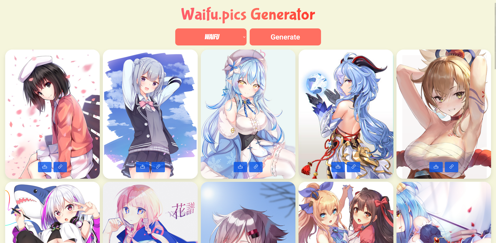

# Waifu App

This is a project that uses the `waifu.pics` API with `React` and `JavaScript`.

Select a `category` from the dropdown list and click the `Generate` button.

Wait for the content to load. Each card have a `download` and a `link` button.



## How to run this project

On a local machine, follow the steps below:

### Prerequisites

Make sure you have Node.js and npm (or yarn) installed on your machine. You can check the versions with the commands `node -v` and `npm -v` (or `yarn -v`).

### Backend

1.  Navigate to the `nodejs-backend` folder:

    ```sh
    cd nodejs-backend
    ```

2.  Install dependencies:

    ```sh
    npm install  # Or yarn install
    ```

3.  Start the backend:

    ```sh
    npm run dev
    ```

    The backend will be available at `http://localhost:1337`.

### Frontend

1.  Navigate to the `react-frontend` folder:

    ```sh
    cd react-frontend
    ```

2.  Install dependencies:

    ```sh
    npm install # Or yarn install
    ```

3.  Start the frontend:

    ```sh
    npm start
    ```

    The frontend will be available at `http://localhost:3000`.

## Technologies & Libraries Used

*   **Frontend:**
    *   [React](https://pt-br.legacy.reactjs.org/)
    *   [JavaScript](https://developer.mozilla.org/pt-BR/docs/Web/JavaScript)
    *   [Axios](https://www.npmjs.com/package/axios)
    *   [File-Saver](https://www.npmjs.com/package/file-saver)
    *   [Phosphor-React](https://www.npmjs.com/package/phosphor-react)
*   **Backend:**
    *   [Node.js](https://nodejs.org/en)
    *   [Express](https://www.npmjs.com/package/express)
    *   [Axios](https://www.npmjs.com/package/axios)
    *   [Cors](https://www.npmjs.com/package/cors)
    *   [Nodemon (dev)](https://www.npmjs.com/package/nodemon)
*   **API:** [waifu.pics](https://waifu.pics/docs)

    

## Features

*   Category selection
*   Generation of images in Cards
*   Download image
*   Link to image 