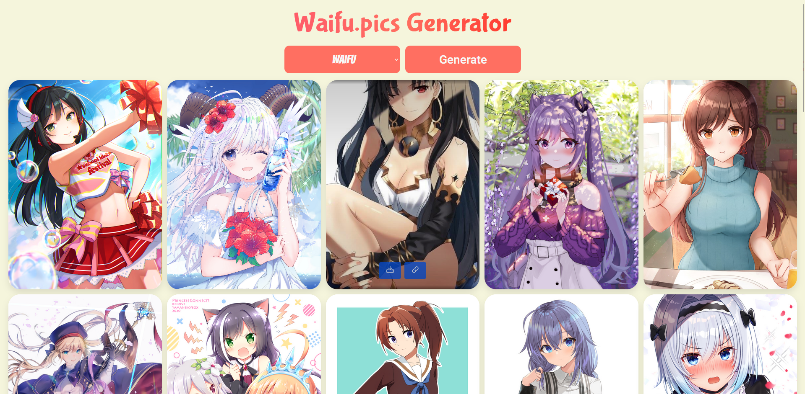

# Waifu App 👩

This is a project that uses the `waifu.pics` API with `React` and `JavaScript`.

Select a `category` from the dropdown list and click the `Generate` button.

Wait for the content to load. Each card have a `download` and a `link` button.

<a href="https://tufcoder.github.io/playground-waifu-app/" target="_blank" rel="noreferrer noopener">
  
</a>


## How to run this project ⚙️

On a local machine, follow the steps below:

### Prerequisites 📝

Make sure you have Node.js and npm (or yarn) installed on your machine. You can check the versions with the commands `node -v` and `npm -v` (or `yarn -v`).

### Backend ⌨️

1.  Navigate to the `nodejs-backend` folder:

    ```sh
    cd nodejs-backend
    ```

2.  Install dependencies:

    ```sh
    npm install  # Or yarn install
    ```

3.  Start the backend:

    ```sh
    npm run dev
    ```

    The backend will be available at `http://localhost:1337`.

### Frontend 💻

I have 2 frontends, `react-frontend-js` and `vite-frontedn-js`.
The Vite frontend will be published with github pages.


### Preview 📺

<https://tufcoder.github.io/playground-waifu-app>

### Using `vite-frontend-js` ⚡

1.  Navigate to the `vite-frontend-js` folder:

    ```sh
    cd vite-frontend-js
    ```

2.  Install dependencies:

    ```sh
    npm install # Or yarn install
    ```

3.  Start the frontend:

    ```sh
    npm run dev
    ```

    The frontend will be available at `http://localhost:5173`.

### Using `react-frontend-js` ⚛️

1.  Navigate to the `react-frontend-js` folder:

    ```sh
    cd react-frontend-js
    ```

2.  Install dependencies:

    ```sh
    npm install # Or yarn install
    ```

3.  Start the frontend:

    ```sh
    npm start
    ```

    The frontend will be available at `http://localhost:3000`.

## Technologies & Libraries Used 📚

*   **Frontend:**
    *   [React](https://pt-br.legacy.reactjs.org/)
    *   [JavaScript](https://developer.mozilla.org/pt-BR/docs/Web/JavaScript)
    *   [Axios](https://www.npmjs.com/package/axios)
    *   [File-Saver](https://www.npmjs.com/package/file-saver)
    *   [Phosphor-React](https://www.npmjs.com/package/phosphor-react)
    *   [Emotion](https://www.npmjs.com/package/@emotion/react)
    *   [Dotenv](https://www.npmjs.com/package/dotenv)
    *   [PropTypes](https://www.npmjs.com/package/prop-types)
*   **Backend:**
    *   [Node.js](https://nodejs.org/en)
    *   [Express](https://www.npmjs.com/package/express)
    *   [Axios](https://www.npmjs.com/package/axios)
    *   [Cors](https://www.npmjs.com/package/cors)
    *   [Nodemon (dev)](https://www.npmjs.com/package/nodemon)
*   **API:** *waifu.pics*
    <a href="https://waifu.pics/docs" target="_blank" rel="noreferrer noopener">
        
    </a>

## Features 🪶

*   Category selection
*   Generation of images in Cards
*   Download image
*   Link to image 

## Thanks To 👍

*   [CODE TABS](https://codetabs.com/)
    Thanks for the [CORS Proxy API](https://codetabs.com/cors-proxy/cors-proxy.html) solution it's very usefull for my download button. I use this in my vite-frontend-js project and was great!